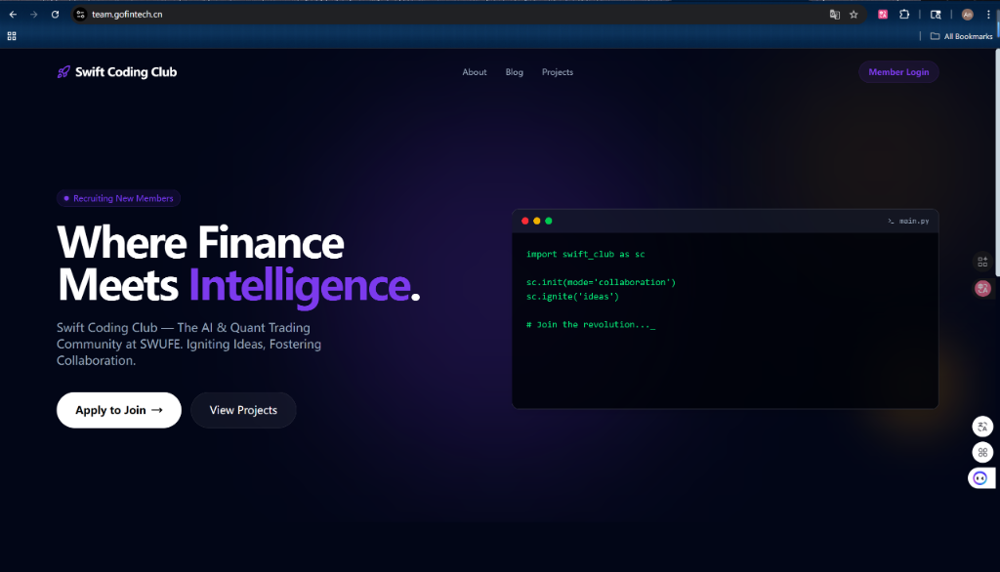
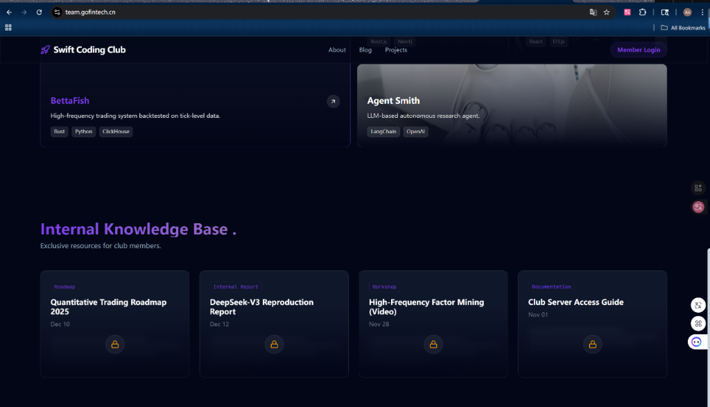
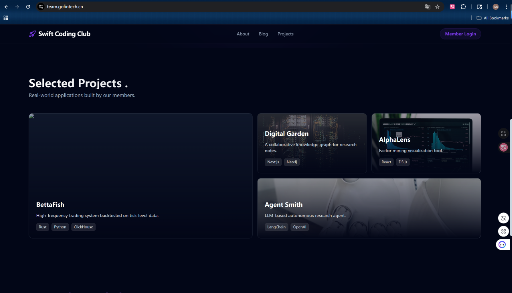

# Swift Coding Club 🚀

**Where Finance Meets Intelligence**  
The AI & Quant Trading Community at SWUFE. Igniting Ideas, Fostering Collaboration.

---

## 📸 Platform Preview

### 🏠 Home - Where Finance Meets Intelligence



### 📚 Internal Knowledge Base

_Exclusive resources for club members including roadmaps and reports._


### 🚀 Selected Projects

_Real-world applications built by our members._


---

## 🛠 Getting Started

This is a [Next.js](https://nextjs.org) project.

### Development

First, run the development server:

```bash
npm run dev
# or
yarn dev
# or
pnpm dev
# or
bun dev
```

Open [http://localhost:3000](http://localhost:3000) with your browser to see the result.

## 🤝 Join Us

Swift Coding Club — where innovation happens.
